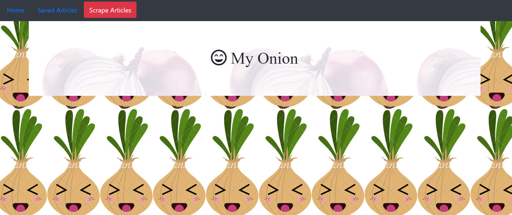

A website scraping application pulling articles from The Onion. This application is connected to a Mongo Database and saves the user's selected  articles for further reading or reference. When finished, articles can be removed from the saved articles. Libraries and frameworks used are Handlebars, Node JS, Mongoose,Mongo DB. 

https://hydro-chesterfield-71182.herokuapp.com

